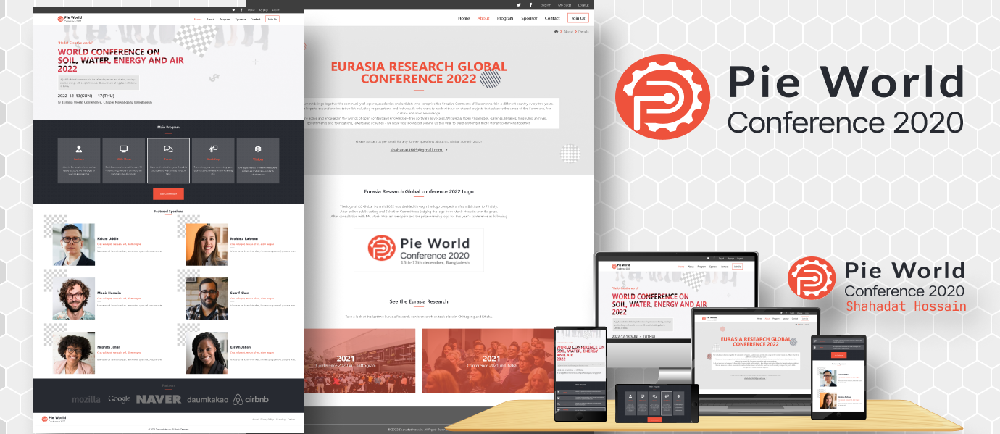

<a name="readme-top"></a>

<p align="center">
  
</p>
<h3 align="center"><b>Pie World Conference</b></h3>
# 📗 Table of Contents

- [📖 About the Project](#about-project)
  - [🛠 Built With](#built-with)
    - [Tech Stack](#tech-stack)
  - [🚀 Live Demo](#live-demo)
  - [👁 presentation](#live-demo)
- [💻 Getting Started](#getting-started)
  - [Prerequisites](#prerequisites)
  - [Setup](#setup)
  - [Install](#install)
- [👥 Authors](#authors)
- [🔭 Future Features](#future-features)
- [🤝 Contributing](#contributing)
- [⭐️ Show your support](#support)
- [🙏 Acknowledgements](#acknowledgements)
- [❓ FAQ](#faq)
- [📝 License](#license)

<!-- PROJECT DESCRIPTION -->

# 📖 [🎯 Pie World Conference Page: Microverse capstone project] <a name="about-project"></a>

> 🚧 This capstone project I am going to build a website is based on an online website for a conference. The website is based on the CC-Global-Summit-2015 design which Cindy Shin creates. Images uses in this project are from unsplash.🚧

## 🛠 Built With <a name="built-with"></a>

### Tech Stack <a name="tech-stack"></a>

<details>
  <summary>Technology</summary>
  <ul>
    <li>HTML</li>
    <li>CSS</li>
    <li>Javascript</li>
  </ul>
</details>

<details>
  <summary>Tools</summary>
  <ul>
    <li> VS Code</li>
    <li>GIT</li>
    <li>GITHUB</li>
    <li>Tailwind CSS</li>
  </ul>
</details>

## 🚀 Live Demo <a name="live-demo"></a>

- [Live Demo Link](https://shahadat3669.github.io/pie-world-conference-page)
<p align="right">(<a href="#readme-top">back to top</a>)</p>

## 👁 Presentation <a name="presentation"></a>

- [presentation Link](https://www.loom.com/share/ed1887a99d9645bb99272ea74f5a814b)
<p align="right">(<a href="#readme-top">back to top</a>)</p>

## 💻 Getting Started <a name="getting-started"></a>

To get a local copy up and running follow these simple example steps.

### Prerequisites

you have to those tools in your local machine.

- [ ] NPM
- [ ] GIT & GITHUB
- [ ] Any Code Editor (VS Code, Brackets, etc)

### Setup

Clone the project.

```bash
  git clone https://github.com/shahadat3669/pie-world-conference-page.git
```

Go to the project directory.

```bash
  cd pie-world-conference-page
```

### Install

Now in terminal run `npm install` to install all dependencies.

```bash
  npm install
```

Now you can use any browser to open the `index.html`.

<p align="right">(<a href="#readme-top">back to top</a>)</p>

<!-- AUTHORS -->

## 👥 Authors <a name="authors"></a>

### First Author:

**Shahadat Hossain**

[](https://github.com/shahadat3669) [](https://linkedin.com/in/shahadat3669) [](https://twitter.com/shahadat3669)

<p align="right">(<a href="#readme-top">back to top</a>)</p>

<!-- CONTRIBUTING -->

## 🤝 Contributing <a name="contributing"></a>

Contributions, issues, and feature requests are welcome!

Feel free to check the [issues page](../../issues/).

<p align="right">(<a href="#readme-top">back to top</a>)</p>

<!-- SUPPORT -->

## 👋 Show your support <a name="support"></a>

Give a ⭐️ if you like this project!

<p align="right">(<a href="#readme-top">back to top</a>)</p>

<!-- ACKNOWLEDGEMENTS -->

## 🔭Acknowledgments <a name="acknowledgements"></a>

- My Family.
- [Microverse Team](https://www.microverse.org/).
- Spacial thank to [Cindy Shin](https://www.behance.net/gallery/29845175/CC-Global-Summit-2015) for his beautiful design.
- Images uses in this project are from [unsplash](https://unsplash.com/).

<p align="right">(<a href="#readme-top">back to top</a>)</p>

<!-- FAQ (optional) -->

## ❓ FAQ <a name="faq"></a>

- **Are you using the same fonts family as in the design?**

  - No becouse the font family used in the design is come with a subscripting. That's why I use a free google font family name Lato which is simmilar to the design.

- **Where I can get the imageas?**

  - The images are all from unplash.com. Those are free to use.

<p align="right">(<a href="#readme-top">back to top</a>)</p>

## 📝 License <a name="license"></a>

This project is [MIT](./LICENSE) licensed.

<p align="right">(<a href="#readme-top">back to top</a>)</p>
